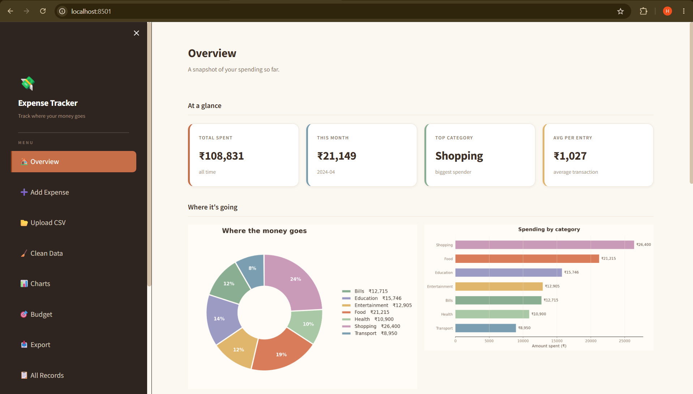
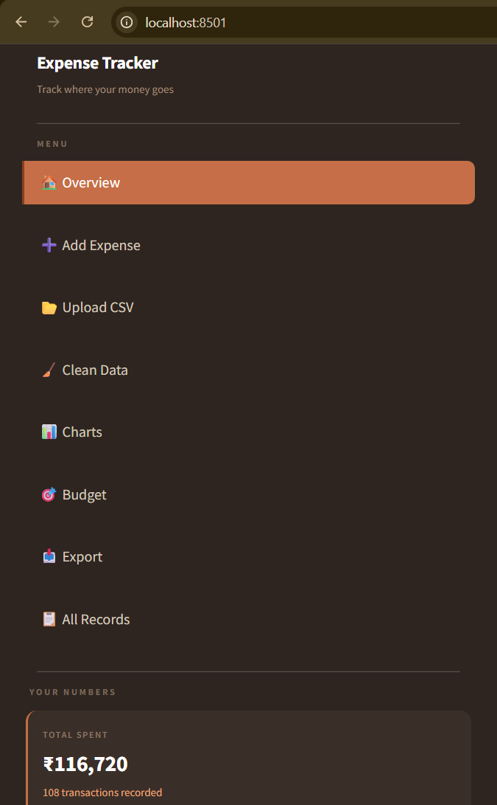
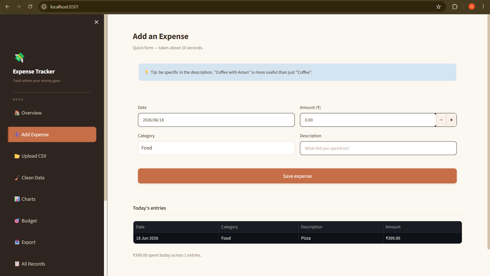
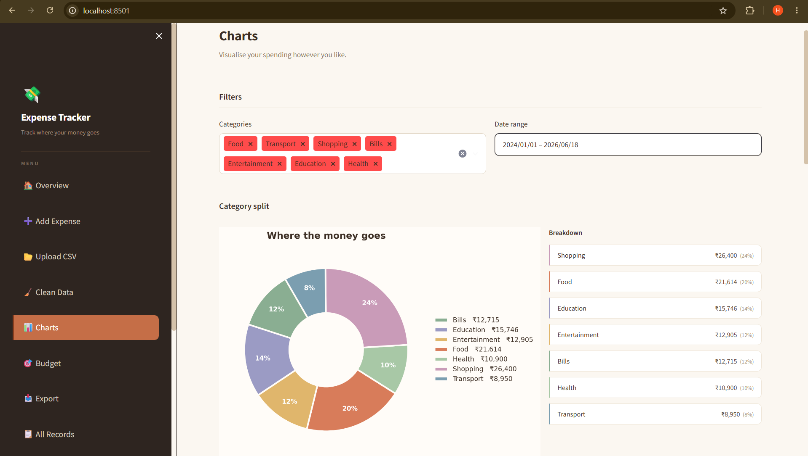
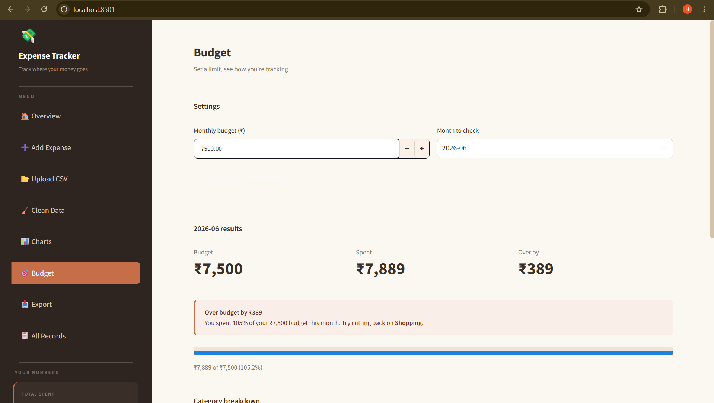
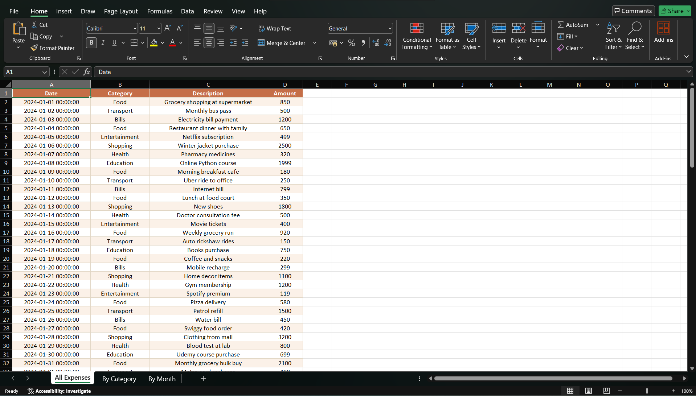

# 💸 Expense Tracker with Visuals

A clean, web-based expense tracking dashboard built with Python and Streamlit. Add expenses through a form or upload a CSV, visualize your spending patterns, set monthly budget alerts, and export everything to a formatted Excel report.

---

## 🖼️ Screenshots

### Dashboard Overview


### Sidebar Navigation


### Add an Expense


### Spending Charts


### Budget Alerts


### Excel Report Export


---

## ✨ Features

- **Add expenses manually** through a clean form
- **Upload CSV files** to bulk-import existing data
- **Auto-clean data** — remove duplicates, fix bad dates, drop invalid amounts
- **Dashboard with KPIs** — Total spent, This month, Top category, Average per entry
- **Multiple visualizations** — Pie chart, bar chart, monthly trend, heatmap
- **Budget alerts** — Green/Yellow/Red status based on usage
- **Per-category budget tracking**
- **Excel export** with 3 formatted sheets (All Expenses, By Category, By Month)
- **CSV export** for portability
- **Filter and search** through all records
- **Warm, readable UI** — designed for daily use

---

## 🛠️ Tech Stack

| Tool | Purpose |
|------|---------|
| Python 3.10+ | Core language |
| Streamlit | Web UI framework |
| Pandas | Data manipulation and cleaning |
| Matplotlib | Chart generation |
| OpenPyXL | Excel report creation |

---

## 📦 Installation

### 1. Clone the repository

```bash
git clone https://github.com/Harshitd13/Expense-Tracker.git
cd Expense-Tracker
```

### 2. Create a virtual environment

```bash
python -m venv venv

# Windows
venv\Scripts\activate

# Mac/Linux
source venv/bin/activate
```

### 3. Install dependencies

```bash
pip install -r requirements.txt
```

### 4. Run the app

```bash
streamlit run app.py
```

The app will open automatically at `http://localhost:8501`.

---

## 📂 Folder Structure

```
Expense-Tracker/
│
├── app.py                  # Main Streamlit application
├── expenses.csv            # Sample dataset (100+ entries)
├── requirements.txt        # Python dependencies
├── README.md               # This file
├── Internship_Report.pdf   # 2-page project report
│
├── reports/
│   └── Expense_Report.xlsx # Generated Excel export
│
└── screenshots/
    ├── dashboard.png
    ├── sidebar.png
    ├── add_expense.png
    ├── charts.png
    ├── budget_alert.png
    └── excel_report.png
```

---

## 📋 Sample Dataset

The included `expenses.csv` has **100+ realistic entries** across 7 categories:

- 🍔 Food
- 🚌 Transport  
- 🛍️ Shopping
- 💡 Bills
- 🎬 Entertainment
- 📚 Education
- 🏥 Health

Data spans January to April 2024.

---

## 🚀 How to Use

1. **Add an expense** — Fill the form on the "Add Expense" page
2. **Or upload CSV** — Use "Upload CSV" to import existing data
3. **Check Overview** — See KPIs and charts at a glance
4. **Visualize** — Use "Charts" to filter and explore patterns
5. **Set a budget** — Go to "Budget" and define a monthly limit
6. **Export** — Generate an Excel report from "Export" page

---

## 🔮 Future Improvements

- Multi-user authentication
- SQLite/PostgreSQL backend instead of CSV
- Recurring expense automation
- AI-based spending predictions
- Mobile-responsive layout
- Email alerts when budget exceeded
- Receipt image upload with OCR

---

## 👨‍💻 Author

**Harshit Dwivedi**

- GitHub: [@Harshitd13](https://github.com/Harshitd13)
- LinkedIn: [linkedin.com/in/harshit-dwivedi-88472831a](https://www.linkedin.com/in/harshit-dwivedi-88472831a)

---

## 📄 License

This project is for educational purposes as part of the Elevate Labs Python Developer Internship.
